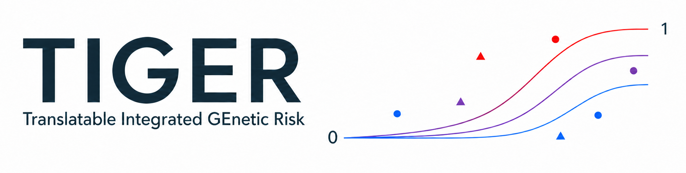
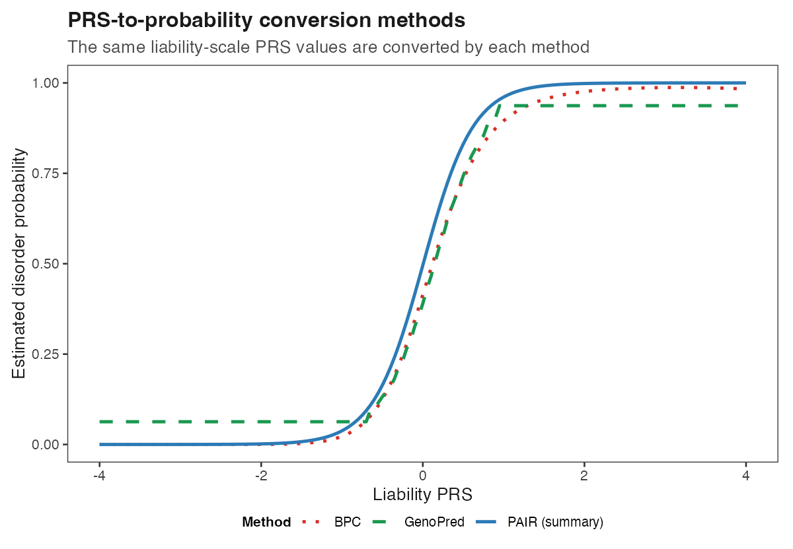

<p align="center">
  
</p>

TIGER is an R framework for converting a liability-scale polygenic risk score
(PRS) into a disorder probability and optionally incorporating rare variants
(RVs) and a separately modelled common high-impact variant such as APOE.

```text
Liability-scale PRS  ──┬─> PRS probability
                       ├─> PRS + RV probability
                       ├─> PRS + APOE probability
                       └─> PRS + APOE + RV probability
```

APOE and RVs are independent optional layers. APOE is not treated as an RV.

## Installation

```r
install.packages("remotes") # once, if needed
remotes::install_github(
  "kaiyao28/TIGER-Translatable-Integrated-Genetic-Risk-Framework",
  build_vignettes = FALSE
)
library(TIGER)
```

Core calculations require R 4.1 or later. Plotting functions require
`ggplot2`, and reading supplied Excel references requires `readxl`.

## 1. Prepare the liability-scale PRS

All TIGER probability methods require a correctly centred liability-scale PRS.
Target and population-reference scores must use the same variants, effect
alleles, effect estimates, and reference-frequency centring.

```r
converted <- prepare_liability_prs_inputs(
  target_prs_observed = target$PRS_observed,
  reference_prs_observed = reference$PRS_observed,
  K = 0.01,
  SP = 0.50,
  center_on_reference = FALSE
)

individuals$PRS_liability <- converted$target_prs_liability
reference_prs_liability <- converted$reference_prs_liability
r2_liability <- converted$r2_liability
```

Use `center_on_reference = FALSE` when both input scores were already centred
using the same population-reference allele frequencies. Do not independently
standardise the target and reference PRSs.

If reference-derived liability-scale R² is unavailable, a compatible
independently evaluated or leave-one-out observed-scale R² may be converted:

```r
r2_liability <- observed_to_liability_r2(
  r2_observed = reported_r2_observed,
  K = 0.01,
  SP = SP_evaluation
)
```

`SP_evaluation` is the case proportion in the sample where the observed-scale
R² was estimated. See the [liability-scale PRS guide](docs/LIABILITY_PRS_GUIDE.md)
for score construction, centring, R² alternatives, and quality control.

## 2. Prepare one individual table

One row represents one person. Only `ID` and `PRS_liability` are required.
Group, RV, and APOE columns are optional.

| ID   | PRS_liability | Group (optional) | RV_status (optional) | APOE (optional) |
| ---- | ------------: | ---------------- | -------------------- | --------------- |
| P001 |         -0.42 | Control          |                      | e3/e3           |
| P002 |          0.31 | Case             | RISK_A               | e3/e4           |
| P003 |          0.18 | Case             | RISK_A;PROTECT_C     | e4/e4           |

Column names can be specified when calling `tiger_probabilities()`. RV status
may be a delimited list of RV-reference IDs or separate logical/0–1 columns.
`Group` is optional plotting information only and does not affect any
probability calculation.

When RVs are included, provide one reference row per RV. Its `ID` must match
the value used in `RV_status`:

| ID        | Symbol | Class      | Case_freq | Control_freq |  OR |
| --------- | ------ | ---------- | --------: | -----------: | --: |
| RISK_A    | GENE_A | PTV        |     0.010 |        0.002 | 8.0 |
| PROTECT_C | GENE_C | Protective |     0.003 |        0.008 | 0.4 |

When APOE is included, provide mutually exclusive genotype frequencies among
cases and controls. Each frequency column must sum to one:

| Genotype | Case_freq | Control_freq |
| -------- | --------: | -----------: |
| e2/e2    |    0.0016 |       0.0064 |
| e2/e3    |    0.0528 |       0.1264 |
| e2/e4    |    0.0240 |       0.0208 |
| e3/e3    |    0.4356 |       0.6241 |
| e3/e4    |    0.3960 |       0.2054 |
| e4/e4    |    0.0900 |       0.0169 |

These values are illustrative. Use references appropriate to the phenotype,
ancestry, population, and intended probability scale. See
[DATA.md](docs/DATA.md) for complete schemas and
[REFERENCE_DATA.md](docs/REFERENCE_DATA.md) for reference preparation and
provenance.

## 3. Calculate probabilities

`tiger_probabilities()` is the main application function. PRS + RV + APOE is
shown below. Disable either optional layer by setting its flag to `FALSE`.

```r
results <- tiger_probabilities(
  data = individuals,
  K = 0.01,
  SP = 0.50,
  method = "PAIR (summary)",
  id_col = "ID",
  prs_col = "PRS_liability",
  group_col = "Group",
  r2_liability = r2_liability,
  include_rv = TRUE,
  rv_reference = rv_reference,
  rv_status_col = "RV_status",
  rv_prevalence = 0.50,
  include_apoe = TRUE,
  apoe_col = "APOE",
  apoe_reference = apoe_reference
)
```

The input columns and row order are preserved. Depending on the enabled
layers, TIGER appends:

- `Probability_PRS`
- `Probability_PRS_RV`
- `Probability_PRS_APOE`
- `Probability_PRS_APOE_RV`

RV count and damaging/protective component columns are also returned when RVs
are enabled.

### PRS only

```r
results_prs <- tiger_probabilities(
  individuals,
  K = 0.01, SP = 0.50,
  method = "PAIR (summary)",
  r2_liability = r2_liability
)
```

`results_prs$Probability_PRS` contains the PRS-derived probability. The optional
`plot_tiger_prs_methods()` example below compares the available methods.



### PRS + RV

```r
results_rv <- tiger_probabilities(
  individuals,
  K = 0.01, SP = 0.50,
  method = "PAIR (summary)",
  r2_liability = r2_liability,
  include_rv = TRUE,
  rv_reference = rv_reference,
  rv_status_col = "RV_status",
  rv_prevalence = 0.50
)
```

`results_rv` contains `Probability_PRS` and `Probability_PRS_RV`, allowing the
probability before and after RV incorporation to be compared directly. The
optional example uses `plot_tiger_rv_carrier_points()`.


### PRS + APOE

```r
results_apoe <- tiger_probabilities(
  individuals,
  K = 0.01, SP = 0.50,
  method = "PAIR (summary)",
  r2_liability = r2_liability,
  include_apoe = TRUE,
  apoe_col = "APOE",
  apoe_reference = apoe_reference
)
```

`results_apoe` contains `Probability_PRS` and `Probability_PRS_APOE`. The
optional `plot_tiger_apoe_curves()` example shows how the same PRS maps to
genotype-specific probabilities.


### PRS + APOE + RV

```r
results_combined <- tiger_probabilities(
  individuals,
  K = 0.01, SP = 0.50,
  method = "PAIR (summary)",
  r2_liability = r2_liability,
  include_rv = TRUE,
  rv_reference = rv_reference,
  rv_status_col = "RV_status",
  rv_prevalence = 0.50,
  include_apoe = TRUE,
  apoe_col = "APOE",
  apoe_reference = apoe_reference
)
```

`results_combined` contains all four probability conditions. The optional
`plot_tiger_apoe_rv_carrier_points()` example shows RV-adjusted carrier
probabilities relative to the APOE genotype distributions.


RVs require an RV effect reference. For APOE, a user-supplied population- and
phenotype-matched reference is preferred. If it is omitted, TIGER reports that
the illustrative bundled reference is being used. A separately modelled APOE
region should be excluded from the input PRS.

## Probability methods

TIGER supports:

- `"BPC"`
- `"GenoPred"`
- `"PAIR (summary)"`, using theoretical moments derived from liability-scale R²
- `"PAIR (sample)"`, using case/control PRS moments from a suitable sample

Change the `method` argument and supply its required inputs. PAIR (summary) is
used in the worked example. See [METHODS.md](docs/METHODS.md) for definitions,
assumptions, formulas, and the lower-level method-specific functions.

## Plotting is optional

The returned table can be analysed or plotted with any software. TIGER's
plotting functions are optional conveniences and are kept separate from the
probability calculations.

- [PLOTTING.md](docs/PLOTTING.md) explains the available plots, aesthetics,
  labels, colours, point sizes, and direct `ggplot2` editing.
- [example_data_and_plots.R](examples/example_data_and_plots.R) is a complete
  runnable example using synthetic data.
- Generated example figures are stored under `examples/figures/`.

The helpers used above return ordinary `ggplot` objects, so users may modify
them or plot the returned TIGER probability columns independently.

## Run the examples

From the repository root:

```bash
Rscript examples/liability_conversion_example.R
Rscript examples/example_data_and_plots.R
Rscript tests/run_tests.R
```

The example data are synthetic and require no external individual-level data.

## Documentation

| Guide                                                | Purpose                                              |
| ---------------------------------------------------- | ---------------------------------------------------- |
| [GETTING_STARTED.md](docs/GETTING_STARTED.md)         | Installation, first run, glossary, and common errors |
| [USAGE.md](docs/USAGE.md)                             | Complete high- and lower-level application workflows |
| [LIABILITY_PRS_GUIDE.md](docs/LIABILITY_PRS_GUIDE.md) | Liability-scale PRS preparation and R² inputs       |
| [DATA.md](docs/DATA.md)                               | Individual, RV, and high-impact reference schemas    |
| [METHODS.md](docs/METHODS.md)                         | Probability methods, APOE update, and RV framework   |
| [PLOTTING.md](docs/PLOTTING.md)                       | Optional plotting and customisation                  |
| [REFERENCE_DATA.md](docs/REFERENCE_DATA.md)           | Supplied SCZ/AD references and custom references     |
| [AD_APOE_GUIDE.md](docs/AD_APOE_GUIDE.md)             | APOE-region exclusion and AD/APOE application        |
| [REFERENCES.md](docs/REFERENCES.md)                   | Method publications and adaptations                  |

## Scope

TIGER does not run GWAS, construct PRSs from genotype files, select scientific
inputs, establish clinical utility, or replace external validation. Users must
justify ancestry, population prevalence `K`, sample prevalence `SP`, PRS and
reference compatibility, variant independence, and overlap between separately
modelled components.

TIGER is under development in preparation for publication. See
[CONTRIBUTING.md](docs/CONTRIBUTING.md), [NOTICE.md](docs/NOTICE.md),
[CITATION.cff](CITATION.cff), and the GPL v3-or-later [LICENSE](LICENSE).
