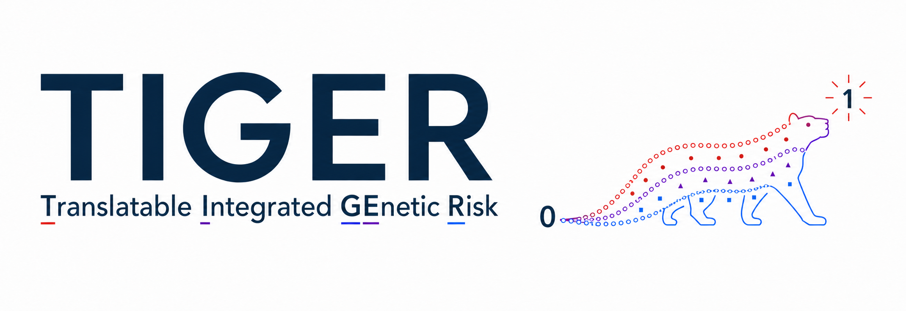
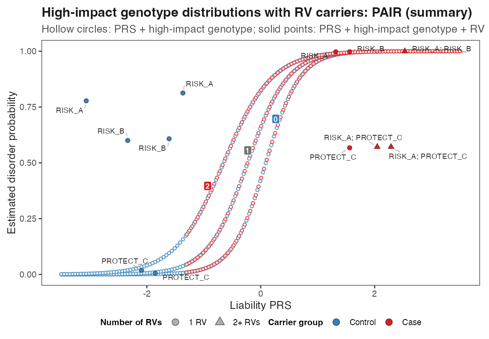

<p align="center">
  
</p>

TIGER is an R package for converting a liability-scale polygenic risk score
(PRS) into an estimated disorder probability and optionally incorporating rare
variants (RVs) and one separately modelled common high-impact component.

```text
Liability-scale PRS ──> estimated disorder probability
                         ├─ PRS only
                         ├─ PRS + RV
                         ├─ PRS + common high-impact component
                         │    ├─ one biallelic variant: 0/1/2 effect alleles
                         │    └─ APOE: six e2/e3/e4 genotypes
                         └─ PRS + common high-impact component + RV
```

The selected method converts PRS to probability. TIGER then applies the
optional high-impact and RV updates. APOE is a six-genotype example of the
high-impact layer, not an RV.

`K` is population prevalence. `SP` is the target-sample case proportion.
`rv_prevalence` is the probability prior for the RV update, not RV frequency.
All included data and reference values are synthetic or hypothetical.

## Installation

```r
install.packages("remotes") # once, if needed
remotes::install_github(
  "kaiyao28/TIGER-Translatable-Integrated-Genetic-Risk",
  build_vignettes = FALSE
)
library(TIGER)
```

Core calculations require R 4.1 or later. Plotting requires `ggplot2`.
`ggrepel` improves optional RV labels, and `readxl` is needed only when
importing a user's own Excel reference.

## Quick start

```text
Prepare liability-scale PRS → check inputs → calculate → inspect → optionally plot
```

This complete hypothetical example calculates PRS and PRS + RV probabilities:

```r
library(TIGER)

r2_liability <- 0.10
individuals <- data.frame(
  ID = c("P001", "P002", "P003"),
  PRS_liability = c(-0.42, 0.31, 0.18),
  RV_IDs = c("", "RISK_A", "PROTECT_C")
)

rv_reference <- data.frame(
  RV_IDs = c("RISK_A", "PROTECT_C"),
  Class = c("PTV", "CNV"),
  OR = c(8.0, 0.4)
)

check_tiger_inputs(
  individuals,
  include_rv = TRUE,
  rv_reference = rv_reference,
  rv_status_col = "RV_IDs"
)

results <- tiger_probabilities(
  individuals,
  K = 0.01,
  SP = 0.50,
  method = "PAIR (summary)",
  r2_liability = r2_liability,
  include_rv = TRUE,
  rv_reference = rv_reference,
  rv_status_col = "RV_IDs",
  rv_prevalence = 0.50
)

results[c("ID", "Probability_PRS", "Probability_PRS_RV")]
```

The output preserves every input row and column and appends the requested
probability columns.

## Probability methods

These methods convert PRS to probability before optional TIGER updates:

| Method | Use when |
|---|---|
| `"PAIR (summary)"` | Population prevalence and liability-scale R² are available |
| `"PAIR (sample)"` | Suitable case/control PRS means and variances are available |
| `"BPC"` | Applying or reproducing the BPC conversion |
| `"GenoPred"` | Applying or reproducing the GenoPred conversion |

The examples use `"PAIR (summary)"`. See
[METHODS.md](docs/METHODS.md) for inputs, assumptions, and formulas.

## Required inputs

All methods require a correctly centred liability-scale PRS. Target and
population-reference scores must use consistent variants, effect alleles,
weights, and reference-frequency centring. See the
[liability-scale PRS guide](docs/LIABILITY_PRS_GUIDE.md) for score preparation
and observed-to-liability R² conversion.

One row represents one individual. Only `ID` and `PRS_liability` are required:

| ID | PRS_liability | Group (optional) | RV_IDs (optional) | High_impact_genotype (optional) | APOE_genotype (optional) |
|---|---:|---|---|---|---|
| P001 | -0.42 | Control |  | 0 | e3/e3 |
| P002 | 0.31 | Case | RISK_A | 1 | e3/e4 |
| P003 | 0.18 | Case | RISK_A;PROTECT_C | 2 | e4/e4 |

`Group` is retained for analysis or plotting and does not enter the
calculation. Generic high-impact and APOE columns are alternative uses of one
layer and should not be enabled together.

The matching fields are:

| Individual field | Reference field |
|---|---|
| `RV_IDs` | `RV_IDs` |
| `High_impact_genotype` | `High_impact_genotype` |
| `APOE_genotype` | `APOE_genotype` |

An RV reference can combine variant or burden classes:

| RV_IDs | Class | OR |
|---|---|---:|
| RISK_A | PTV | 8.0 |
| PROTECT_C | CNV | 0.4 |

`RV_IDs` performs matching and `OR` drives the update. `Class` and `Symbol`
are optional metadata. When `OR` is unavailable, TIGER can calculate it from
`Case_freq` and `Control_freq`; `Population_freq` may substitute for a missing
control frequency when scientifically justified.

High-impact references contain mutually exclusive genotype rows with
`Case_freq` and `Control_freq`, each summing to one. Before modelling a
high-impact component separately, exclude it and a justified LD-aware region
from PRS construction and R² estimation.

Hypothetical CSV templates are included for the
[individual table](inst/extdata/templates/individual_template.csv),
[RV reference](inst/extdata/templates/rv_reference_template.csv),
[APOE reference](inst/extdata/templates/apoe_reference_template.csv), and
[generic high-impact reference](inst/extdata/templates/high_impact_reference_template.csv).
Locate installed copies with `tiger_template_file()`.

## Combined model

After preparing the required columns and references:

```r
individuals$APOE_genotype <- c("e3/e3", "e3/e4", "e4/e4")
apoe_reference <- tiger_default_apoe_reference() # hypothetical example only

check_tiger_inputs(
  individuals,
  include_rv = TRUE,
  rv_reference = rv_reference,
  rv_status_col = "RV_IDs",
  include_apoe = TRUE,
  apoe_col = "APOE_genotype",
  apoe_reference = apoe_reference
)

results_combined <- tiger_probabilities(
  individuals,
  K = 0.01,
  SP = 0.50,
  method = "PAIR (summary)",
  r2_liability = r2_liability,
  include_rv = TRUE,
  rv_reference = rv_reference,
  rv_status_col = "RV_IDs",
  rv_prevalence = 0.50,
  include_apoe = TRUE,
  apoe_col = "APOE_genotype",
  apoe_reference = apoe_reference
)
```

| Enabled component | Additional probability columns |
|---|---|
| RV | `Probability_PRS_RV` |
| Generic high-impact component | `Probability_PRS_HIGH_IMPACT`; with RV: `Probability_PRS_HIGH_IMPACT_RV` |
| APOE | `Probability_PRS_APOE`; with RV: `Probability_PRS_APOE_RV` |

RV count and damaging/protective component columns are also returned when RVs
are enabled. See [GETTING_STARTED.md](docs/GETTING_STARTED.md) for separate
PRS, RV, generic high-impact, APOE, and combined examples.

> TIGER probabilities depend on the supplied prevalence, PRS, and reference
> assumptions. They are not automatically calibrated clinical risks and
> require appropriate external validation.

## Example figures

The plotting helpers are optional and return ordinary `ggplot` objects.

| PRS conversion methods | PRS + RV |
|---|---|
|  |  |

| One high-impact variant + RV | APOE + RV |
|---|---|
|  |  |

See [PLOTTING.md](docs/PLOTTING.md) for interpretation and customisation, or run:

```bash
Rscript examples/liability_conversion_example.R
Rscript examples/example_data_and_plots.R
Rscript tests/run_tests.R
```

## Documentation

| Guide | Purpose |
|---|---|
| [GETTING_STARTED.md](docs/GETTING_STARTED.md) | Installation, full examples, and common errors |
| [DATA.md](docs/DATA.md) | Individual and reference schemas |
| [LIABILITY_PRS_GUIDE.md](docs/LIABILITY_PRS_GUIDE.md) | Liability-scale PRS and R² preparation |
| [METHODS.md](docs/METHODS.md) | Probability methods and TIGER updates |
| [USAGE.md](docs/USAGE.md) | High- and lower-level workflows |
| [PLOTTING.md](docs/PLOTTING.md) | Optional plotting and customisation |
| [REFERENCE_DATA.md](docs/REFERENCE_DATA.md) | Preparing a user-supplied RV reference |
| [HIGH_IMPACT_VARIANTS.md](docs/HIGH_IMPACT_VARIANTS.md) | Generic high-impact variants |
| [AD_APOE_GUIDE.md](docs/AD_APOE_GUIDE.md) | APOE-region exclusion and AD application |
| [REFERENCES.md](docs/REFERENCES.md) | Method publications and adaptations |

## Scope

TIGER does not run GWAS, construct PRSs from genotype files, choose scientific
inputs, establish clinical utility, or replace external validation. Users must
justify ancestry, prevalence, PRS and reference compatibility, independence,
and overlap between separately modelled components.

TIGER is under development in preparation for publication. See
[CONTRIBUTING.md](docs/CONTRIBUTING.md), [NOTICE.md](docs/NOTICE.md),
[CITATION.cff](CITATION.cff), and the GPL v3-or-later [LICENSE](LICENSE).
