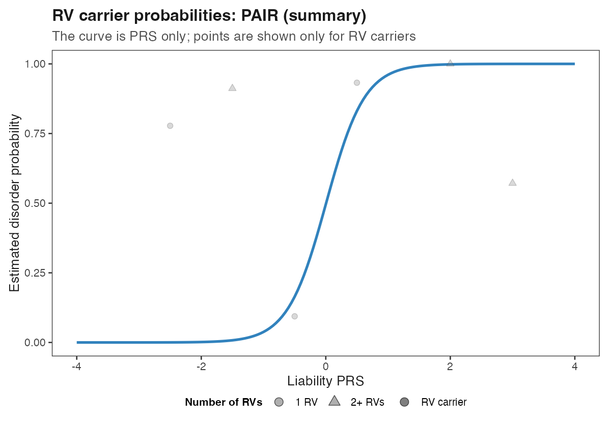
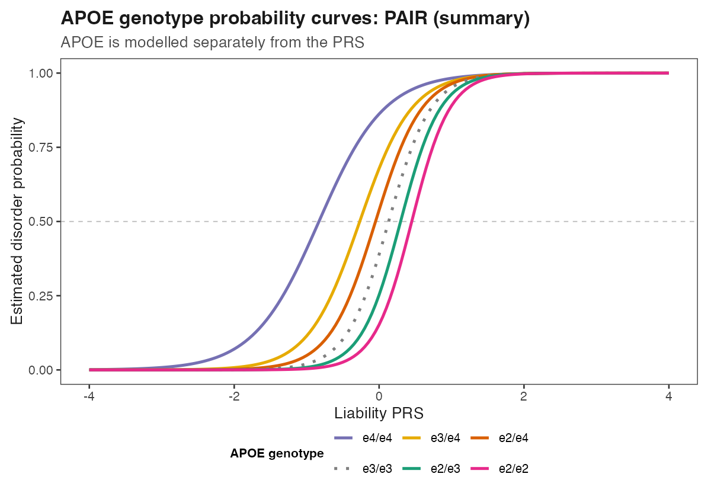
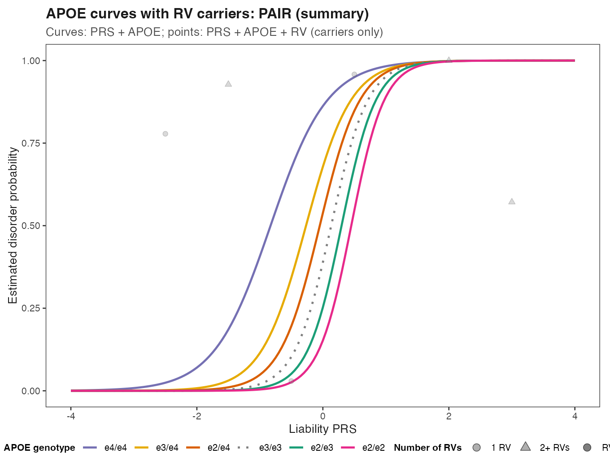

s

# TIGER: Translatable Integrated Genetic Risk framework

TIGER is a simulation-free R framework for estimating absolute binary-disorder
probabilities from polygenic risk, rare variants and separately modelled common
high-impact variants such as APOE.

```text
                         ┌─ PRS only
PRS ─> absolute          ├─ PRS + RV
      probability ───────┼─ PRS + APOE / common high-impact variant
                         └─ PRS + APOE / high-impact variant + RV
```

APOE and RV are separate optional components. APOE is not treated as an RV.

## Start here

1. Prepare a correctly centred liability-scale PRS and matching liability-scale
   PRS R².
2. Supply separate individual records for PRS, APOE status and RV carrier
   status.
3. Supply justified case/control evidence for APOE and RV effects.
4. Choose and justify population prevalence `K`, sample prevalence `SP`, and the RV
   calculation level (`SP_RV`; default 0.50 for a balanced sample).
5. Calculate PRS only, PRS + RV, PRS + APOE, or the combined probability.

The worked-example defaults are:

```r
K <- 0.01
SP <- 0.50
r2_liability <- 0.10
SP_RV <- 0.50
```

PAIR (summary) is the default example method. These values are instructional,
not universal disease parameters.

## Quick example

New to TIGER? Start with [`GETTING_STARTED.md`](docs/GETTING_STARTED.md). Core
calculations use R 4.1+; figures require `ggplot2` and supplied Excel references
require `readxl`.

Install the development version directly from GitHub:

```r
install.packages("remotes") # once, if needed
remotes::install_github("OWNER/TIGER", build_vignettes = FALSE)
library(TIGER)
```

Replace `OWNER` with the repository owner after publication. Package functions
remain plain, reviewable R source under `R/`; installation does not hide the
implementation.

From the `TIGER` directory:

```bash
Rscript examples/liability_conversion_example.R
Rscript examples/example_data_and_plots.R
Rscript tests/run_tests.R
```

The examples use synthetic inputs under `inst/extdata/example/` and produce all four
probability conditions plus the documented plots. No files outside this
repository are required.

## Three application examples

The snippets below assume that the prepared PRS, separate APOE-status file, RV
carrier matrix and references have been loaded as shown in [`USAGE.md`](docs/USAGE.md).

### 1. PRS + RV

```r
p_prs <- pair_probability_summary(
  individuals$PRS_liability, K, SP, r2_liability
)
rv_result <- apply_rv_carriers(
  p_prs, carrier_matrix, rv_effects, prevalence = SP_RV
)

plot_tiger_rv_carrier_points(
  prs_curve = prs_sequence,
  probability_curve = p_sequence,
  carrier_prs = individuals$PRS_liability[carrier_index],
  carrier_probability_before = p_prs[carrier_index],
  carrier_probability_after = rv_result$probability_after[carrier_index],
  rv_count = rv_result$RV_count[carrier_index]
)
```

The curve is PRS only. Points are shown only for RV carriers. A circle denotes
one RV and a triangle denotes two or more RVs. Carrier points use one neutral
fill by default. Optional colours represent user-defined groups and never
damaging or protective RV direction.



### 2. PRS + APOE / common high-impact variant

```r
p_prs_apoe <- high_impact_method_probability(
  individuals$PRS_liability, individuals$APOE, apoe_reference,
  K = K, SP = SP, method = "PAIR (summary)", r2_liability = r2_liability
)

plot_tiger_apoe_curves(
  prs_sequence, p_sequence, apoe_reference,
  K = K, SP = SP, r2_liability = r2_liability
)
```

Each line is the PRS probability updated for one APOE genotype. APOE status is
read from a separate individual-level record and is not treated as an RV.



### 3. PRS + APOE / high-impact variant + RV

```r
combined_result <- apply_rv_carriers(
  p_prs_apoe, carrier_matrix, rv_effects, prevalence = SP_RV
)

plot_tiger_apoe_rv_carrier_points(
  prs_curve = prs_sequence,
  probability_prs = p_sequence,
  apoe_reference = apoe_reference,
  carrier_prs = individuals$PRS_liability[carrier_index],
  carrier_apoe = individuals$APOE[carrier_index],
  carrier_probability_before_rv = p_prs_apoe[carrier_index],
  carrier_probability_after_rv =
    combined_result$probability_after[carrier_index],
  rv_count = rv_result$RV_count[carrier_index],
  K = K, SP = SP, r2_liability = r2_liability
)
```

The lines show PRS + APOE probabilities. Points are shown only for RV carriers
at their final PRS + APOE + RV probability. Shape distinguishes one from
multiple RVs. Fill is neutral unless an external carrier grouping is supplied.



The complete runnable code—including creation of `prs_sequence` and carrier
subsets—is in [`USAGE.md`](docs/USAGE.md) and
`examples/example_data_and_plots.R`.

## Documentation

| Guide                                            | Contents                                                 |
| ------------------------------------------------ | -------------------------------------------------------- |
| [`GETTING_STARTED.md`](docs/GETTING_STARTED.md) | Installation, first run, glossary and common errors      |
| [`USAGE.md`](docs/USAGE.md)                     | Complete application code and plotting examples          |
| [`METHODS.md`](docs/METHODS.md)                 | PAIR summary/sample, BPC, GenoPred, APOE and RV methods  |
| [`PLOTTING.md`](docs/PLOTTING.md)               | Point styling, group colours, legends and ggplot editing |
| [`DATA.md`](docs/DATA.md)                       | PRS, APOE, RV-reference and individual-status schemas    |
| [`REFERENCE_DATA.md`](docs/REFERENCE_DATA.md)   | Separate SCZ/AD references and custom-reference creation |
| [`BPC_INPUT_GUIDE.md`](docs/BPC_INPUT_GUIDE.md) | Liability-scale PRS preparation and quality control      |
| [`AD_APOE_GUIDE.md`](docs/AD_APOE_GUIDE.md)     | APOE-region exclusion and AD/APOE application            |
| [`REFERENCES.md`](docs/REFERENCES.md)           | Method publications and adaptations                      |

## Repository structure

```text
R/                 loader, probability, reference, high-impact, RV and plotting functions
inst/extdata/example/      synthetic input-format examples
inst/extdata/reference/    separate SCZ and AD reference inputs
examples/          runnable application examples and rendered figures
tests/             dependency-light checks
```

## Scope

TIGER does not run GWAS, calculate PRSs from genotype files, select scientific
inputs, establish clinical utility or replace external validation. Users must
justify ancestry, prevalence, SP, score construction, effect evidence,
overlap and independence assumptions. See [`USAGE.md`](docs/USAGE.md) and the focused guides
before application.

## Development

TIGER is under development in preparation for publication. Cloning, testing,
discussion and reviewed pull requests are welcome. See
[`CONTRIBUTING.md`](docs/CONTRIBUTING.md), [`NOTICE.md`](docs/NOTICE.md),
[`CITATION.cff`](CITATION.cff) and the GPL v3-or-later [`LICENSE`](LICENSE).
